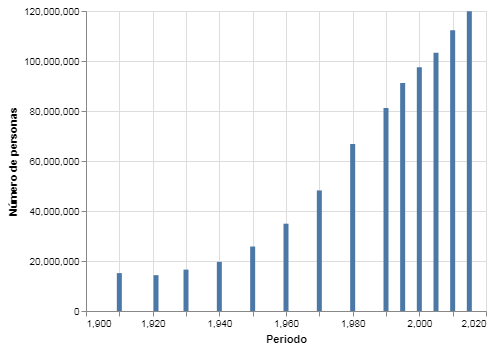

---
redirect_from:
  - "/section-02/1/grafico-de-barras"
interact_link: content/section-02/1/grafico_de_barras.ipynb
title: 'Gráfico de Barras'
prev_page:
  url: /section-02/anatomia-de-un-grafico
  title: 'Anatomía de un Gráfico'
next_page:
  url: /section-02/2/grafico_de_lineas
  title: 'Gráfico de Líneas'
comment: "***PROGRAMMATICALLY GENERATED, DO NOT EDIT. SEE ORIGINAL FILES IN /content***"
---

# Gráfico de barras

***
Un gráfico de barras esta compuesto por rectangulos que van desde el eje X hasta una altura Y. 

Así es como se produce un gráfico de barras en `altair`:


{:.input_area}
```python
# primero importamos las bibliotecas necesarias
# estos alias son convenciones populares
# pero no son requisitos estrictos

import pandas as pd
import altair as alt
```


Si estas trabajando con este __notebook__ en un __jupyter notebook__ y no el __jupyter lab__ requerirás ejecutar el siguiente código también.


{:.input_area}
```python
# alt.renderers.enable("notebook")
```


Los datos con los que vamos a trabajar son de [INEGI](https://inegi.org.mx). En este caso, el número de personas en el país desde 1910.


{:.input_area}
```python
datos = pd.read_csv("../../datos/poblacion.csv")
```


Puedes explorar el __DataFrame__ con el método `.head()` para observar las primeras líneas.


{:.input_area}
```python
datos.head()
```


<div markdown="0">
<div>
<style scoped>
    .dataframe tbody tr th:only-of-type {
        vertical-align: middle;
    }

    .dataframe tbody tr th {
        vertical-align: top;
    }

    .dataframe thead th {
        text-align: right;
    }
</style>
<table border="1" class="dataframe">
  <thead>
    <tr style="text-align: right;">
      <th></th>
      <th>Periodo</th>
      <th>Número de personas</th>
    </tr>
  </thead>
  <tbody>
    <tr>
      <th>0</th>
      <td>1910</td>
      <td>15160369</td>
    </tr>
    <tr>
      <th>1</th>
      <td>1921</td>
      <td>14334780</td>
    </tr>
    <tr>
      <th>2</th>
      <td>1930</td>
      <td>16552722</td>
    </tr>
    <tr>
      <th>3</th>
      <td>1940</td>
      <td>19653552</td>
    </tr>
    <tr>
      <th>4</th>
      <td>1950</td>
      <td>25791017</td>
    </tr>
  </tbody>
</table>
</div>
</div>


Nota que por default `.head()` sólo muestra las primeras 5 líneas pero puedes pasarle cualquier número entero como parametro.


{:.input_area}
```python
datos.head(10)
```


<div markdown="0">
<div>
<style scoped>
    .dataframe tbody tr th:only-of-type {
        vertical-align: middle;
    }

    .dataframe tbody tr th {
        vertical-align: top;
    }

    .dataframe thead th {
        text-align: right;
    }
</style>
<table border="1" class="dataframe">
  <thead>
    <tr style="text-align: right;">
      <th></th>
      <th>Periodo</th>
      <th>Número de personas</th>
    </tr>
  </thead>
  <tbody>
    <tr>
      <th>0</th>
      <td>1910</td>
      <td>15160369</td>
    </tr>
    <tr>
      <th>1</th>
      <td>1921</td>
      <td>14334780</td>
    </tr>
    <tr>
      <th>2</th>
      <td>1930</td>
      <td>16552722</td>
    </tr>
    <tr>
      <th>3</th>
      <td>1940</td>
      <td>19653552</td>
    </tr>
    <tr>
      <th>4</th>
      <td>1950</td>
      <td>25791017</td>
    </tr>
    <tr>
      <th>5</th>
      <td>1960</td>
      <td>34923129</td>
    </tr>
    <tr>
      <th>6</th>
      <td>1970</td>
      <td>48225238</td>
    </tr>
    <tr>
      <th>7</th>
      <td>1980</td>
      <td>66846833</td>
    </tr>
    <tr>
      <th>8</th>
      <td>1990</td>
      <td>81249645</td>
    </tr>
    <tr>
      <th>9</th>
      <td>1995</td>
      <td>91158290</td>
    </tr>
  </tbody>
</table>
</div>
</div>


## Visualización


{:.input_area}
```python
alt.Chart(datos).mark_bar().encode(
    x = "Periodo:Q",
    y = "Número de personas:Q"
)
```





Nota que utilizamos 
```python
    x = "Periodo:Q",
    y = "Número de personas:Q",
```

en nuestro gráfico. La __Q__ le esta indicando a `altair` que interprete los valores de la columna "Periodo" y "Número de personas" como datos de tipo __cuantitativo__ (Q).

Modifica el valor de __Y__ en este gráfico para que sea interpretado como tipo _nominal_ (__N__), _ordinal_ (__O__), y _temporal_ (__T__) para ver como cambia tu gráfico.


{:.input_area}
```python
# Nominal
alt.Chart(datos).mark_bar().encode(
    x = "Periodo:Q",
    y = ""
)
```


{:.input_area}
```python
# Ordinal
alt.Chart(datos).mark_bar().encode(
    x = "",
    y = "",
)
```


{:.input_area}
```python
# Temporal
alt.Chart(datos).
```


### Bonus
¿Cómo modificarías tu gráfico para que las barras sean horizontales?


{:.input_area}
```python
# Horizontal
```

