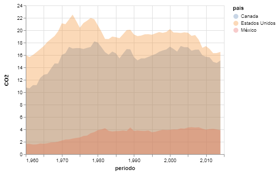

---
redirect_from:
  - "/section-02/4/grafico-de-area"
interact_link: content/section-02/4/grafico_de_area.ipynb
title: 'Gráfico de Area'
prev_page:
  url: /section-02/3/grafico_de_dispersion
  title: 'Gráfico de Dispersíon'
next_page:
  url: /section-02/5/conclusion
  title: 'Conclusión'
comment: "***PROGRAMMATICALLY GENERATED, DO NOT EDIT. SEE ORIGINAL FILES IN /content***"
---

# Gráfico de Área

***
Un gráfico de área es similar a un gráfico de líneas pero se rellena con color el área debajo de cada línea. 

Así es como se produce un gráfico de área en `altair`:


{:.input_area}
```python
# primero importamos las bibliotecas necesarias
# estos alias son convenciones populares
# pero no son requisitos estrictos

import pandas as pd
import altair as alt
```


Si estas trabajando con este __notebook__ en un __jupyter notebook__ y no el __jupyter lab__ requerirás ejecutar el siguiente código también.


{:.input_area}
```python
# alt.renderers.enable("notebook")
```


Los datos con los que vamos a trabajar son del [Banco Mundial](https://data.worldbank.org/indicator/NY.GDP.MKTP.CD?locations=MX). En este caso, las emisiones de CO2 en toneladas métricas per capita.


{:.input_area}
```python
datos = pd.read_csv("../../datos/norteamerica_CO2.csv")
```


Puedes explorar el __DataFrame__ con el método `.head()` para observar las primeras líneas.


{:.input_area}
```python
datos.head()
```


<div markdown="0">
<div>
<style scoped>
    .dataframe tbody tr th:only-of-type {
        vertical-align: middle;
    }

    .dataframe tbody tr th {
        vertical-align: top;
    }

    .dataframe thead th {
        text-align: right;
    }
</style>
<table border="1" class="dataframe">
  <thead>
    <tr style="text-align: right;">
      <th></th>
      <th>pais</th>
      <th>codigo</th>
      <th>nombre del indicador</th>
      <th>CO2</th>
      <th>periodo</th>
    </tr>
  </thead>
  <tbody>
    <tr>
      <th>0</th>
      <td>Canada</td>
      <td>CAN</td>
      <td>CO2 emissions (metric tons per capita)</td>
      <td>10.770847</td>
      <td>1960</td>
    </tr>
    <tr>
      <th>1</th>
      <td>México</td>
      <td>MEX</td>
      <td>CO2 emissions (metric tons per capita)</td>
      <td>1.653382</td>
      <td>1960</td>
    </tr>
    <tr>
      <th>2</th>
      <td>Estados Unidos</td>
      <td>USA</td>
      <td>CO2 emissions (metric tons per capita)</td>
      <td>15.999779</td>
      <td>1960</td>
    </tr>
    <tr>
      <th>3</th>
      <td>Canada</td>
      <td>CAN</td>
      <td>CO2 emissions (metric tons per capita)</td>
      <td>10.627898</td>
      <td>1961</td>
    </tr>
    <tr>
      <th>4</th>
      <td>México</td>
      <td>MEX</td>
      <td>CO2 emissions (metric tons per capita)</td>
      <td>1.657750</td>
      <td>1961</td>
    </tr>
  </tbody>
</table>
</div>
</div>


## Visualización


{:.input_area}
```python
alt.Chart(datos).mark_area(opacity = 0.3).encode(
    x = 'periodo',
    y = 'CO2',
    color = 'pais',
)
```





Nota: Así como puedes modificar las propiedades de `.encode()` también puedes hacerlo en el marcador. En este caso estamos especificando una opacidad de solo el 30%. <br>
Intenta recrear este gráfico sin declarar __opacitiy__ en `.mark_area()` para que veas como se ve el default del gráfico.


{:.input_area}
```python
# Sin usar opacity
alt.Chart(datos).


```

